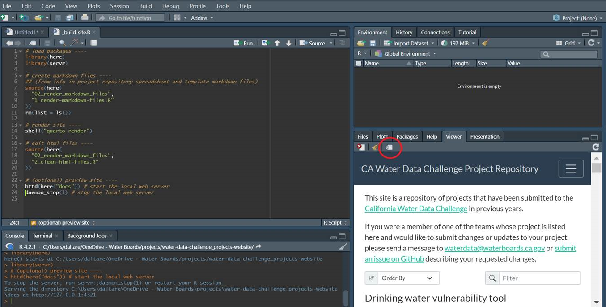

**\### This is a draft \###**

## Water Data Challenge Project Repository Website - Source Files

This repository contains the source files used to build a website that serves as a repository of projects submitted to the [California Water Data Challenge](https://waterchallenge.data.ca.gov/) in previous events. The website is available at: <https://cawaterboarddatacenter.github.io/water-data-challenge-project-repository/>

The website is built with the Quarto publishing system. See the [Quarto website](https://quarto.org/) for more information not covered here about how to modify/customize/render/publish sites using this system.

### Required Tools

In order to use the workflow described below, you'll need to install the following free and open source software:

-   [Quarto CLI](https://quarto.org/docs/get-started)

-   [R Programming Language](https://cloud.r-project.org/)

-   [RStudio IDE](https://www.rstudio.com/products/rstudio/)

### Overview of Website Maintenance Workflow

The workflow used to maintain this site was designed with the goal of being as user friendly as possible for those without extensive experience working with either (1) websites and the associated files (html, css, etc.) or (2) markdown files. Most edits/additions to the site can be accomplished by editing an Excel workbook then running a single R script, as described below.

More specifically, all of the information used to build the individual project pages, as well as the information contained in the Events and Awards pages, is contained in the `01_projects_repository/project_repository_tables` Excel workbook. The website is (re)built by inserting information from that workbook into associated template files, which are in the in the `02_render_markdown_files` folder, to create a series of markdown documents. Then the site is rendered in a process that generates html files from those markdown documents.

So, to add new projects to the repository, or edit the information about existing projects in the repository, only update the information in the Excel workbook, rather than editing the markdown files directly. In other words, the process described below overwrites most of the existing markdown files (i.e., files with a `.qmd` extension) in this directory, except for the `index.qmd` and `about.qmd` files. So, as a general rule, don't make manual edits to any markdown files except for the two listed above - instead make changes to the project repository workbook and the markdown template files as needed, then re-build the site as described below.

### Instructions for Maintaining / Updating the Website

1.  Enter or edit project information in the `01_projects_repository/project_repository_tables` Excel workbook.

    -   The workbook contains multiple worksheets. Project specific information can be entered in the `projects_table` worksheet. Information about awards, topics, and events are in separate worksheets (`awards_table`, `topics_table`, and `events_table`) - these worksheets are linked to the `projects_table` worksheet in the sense that they provide the valid values for associated fields in the `projects_table` worksheet. Add new awards, topics, or events to these worksheets as needed.

    -   Make sure to follow the formatting instructions described in the workbook.

    -   You can enter information in the workbook using [markdown formatting](https://www.markdownguide.org/basic-syntax/).

2.  (Optional) If you need to change the format/layout of the project pages, you'll need to edit the template markdown file (`02_render_markdown_files/project_template.txt`). If you do this, you need to make sure that the edits are consistent with the script that builds the markdown files (`02_render_markdown_files/1_render-markdown-files.R`), or edit the script as needed.

3.  (Optional) You can also change the format/layout of the events, awards, and/or topics pages by editing the associated template markdown files (in the `02_render_markdown_files` folder), and editing the script that builds the markdown files (`02_render_markdown_files/1_render-markdown-files.R`) as needed.

4.  (Optional) You can add new 'main' pages to the website by creating new `.qmd` files in the main project directory (see the `index.qmd` and `about.qmd` files as examples). Then add references to these files in the `_quarto.yml` file (again following the example of the way it's done for the `index.qmd` and `about.qmd` files).

5.  Build the new version of the website by running the `_build-site.R` script. To run the script, open the `water-data-challenge_projects-website.Rproj` file (which opens a new instance of RStudio), then open the `_build-site.R` file (you can open the file from the 'Files' tab in the lower right pane of the RStudio window), then click on the `Source` button, as shown here:    When the script has finished running, a preview of the site will be available in the 'Viewer' tab in the lower right pane of the RStudio window. You can click the 'Show in new window' button to open the preview in a separate browser window:    The `_build-site.R` script:

-   Runs the `02_render_markdown_files/1_render-markdown-files.R` script to build markdown files based on the information in the project repository workbook and the template markdown files (the resulting markdown files are saved in the `projects` folder, and any previous versions of the markdown files in that folder are overwritten)

-   Renders the site by converting the markdown files (`.qmd` files) into html files (by running the command `quarto render`), and saving the rendered files in the `docs` folder (Note: this is the same as 'manually' building the site in RStudio by going to the `Build` tab - near the upper right side of the window - and clicking on the `Render Website` button)

-   Runs the `02_render_markdown_files/2_clean-html-files.R` script to do some minor editing of the rendered html files

-   Previews the site by running a local web server
  Any of these parts can also be run individually as needed.
  More general instructions for rendering quarto websites with other tools / methods are available on the [quarto website](https://quarto.org/)

6.  If the website preview looks correct, push the changes to the GitHub repository. This will automatically update the online version of the site.

-   Note: if you wanted to create a new website in a different repository, you'd need to follow [these instructions](https://quarto.org/docs/websites/publishing-websites.html#github-pages) to set up GitHub pages correctly. But you can ignore this if you're just making updates to this existing site.

### Additional Notes

-   The `_quarto.yml` is used to specify high-level information about how the site is built, e.g., what input files to use, the output directory for rendered files, navigation bar specifications, site-wide formatting, etc.

-   The home page for this site is created from the `index.qmd` file - this file can be edited directly, since it is not overwritten by the process used to rebuild the site; the `listing:` portion of the header info in this file specifies how the projects are listed on the homepage

-   The `custom.scss` file specifies some custom formatting for the site (i.e., it overrides some of the default css)
